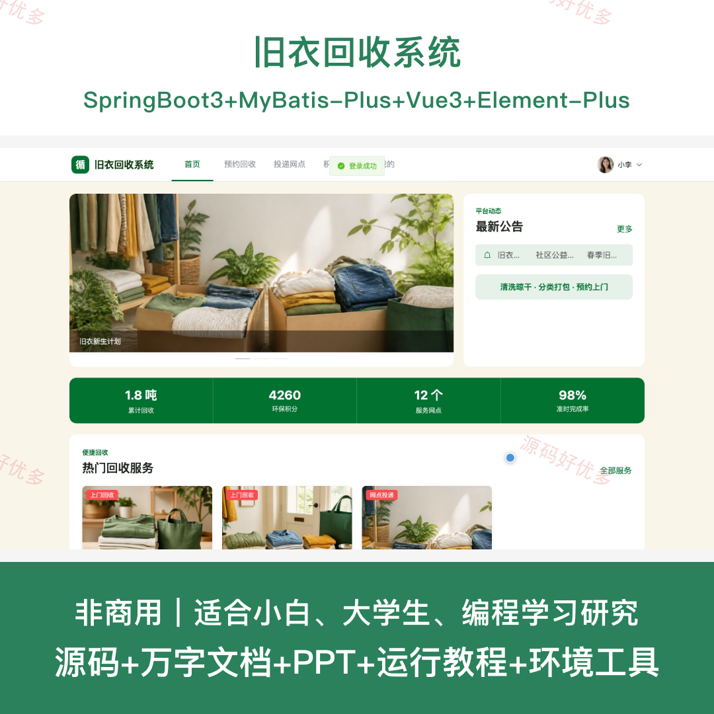
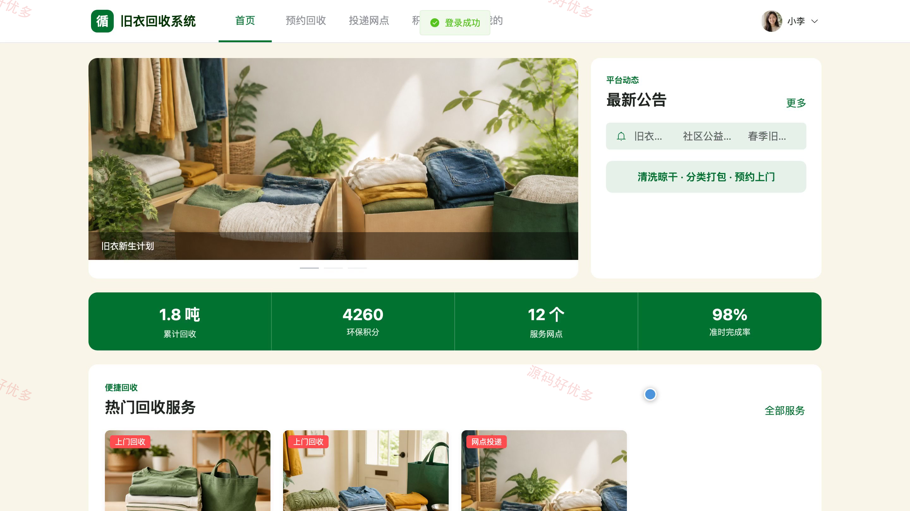
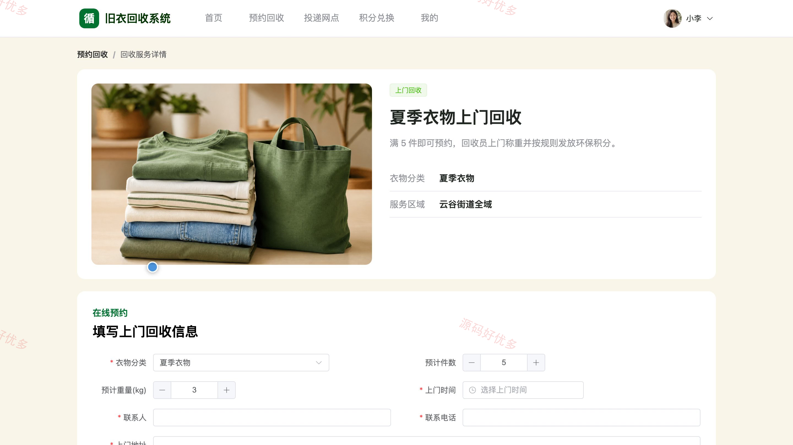
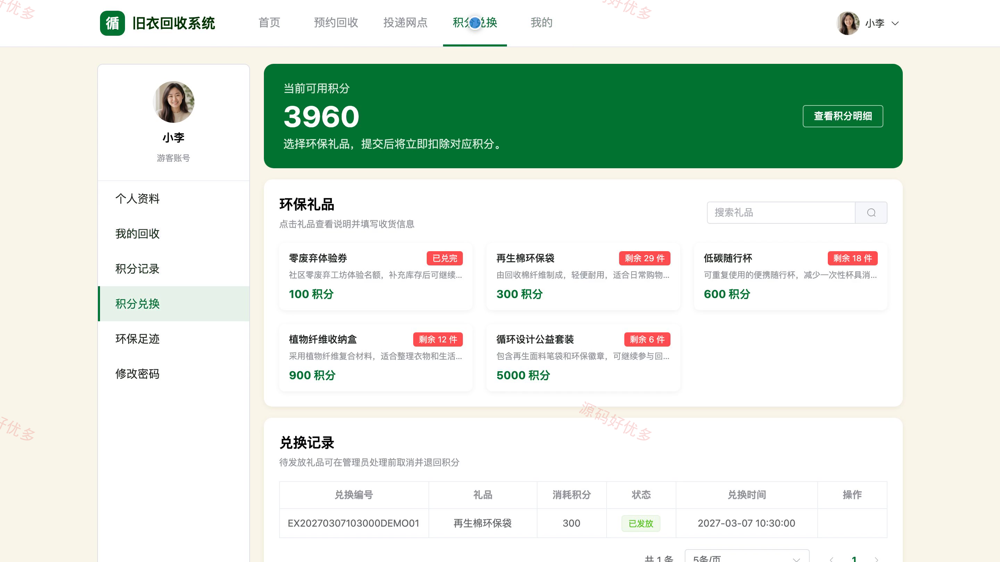
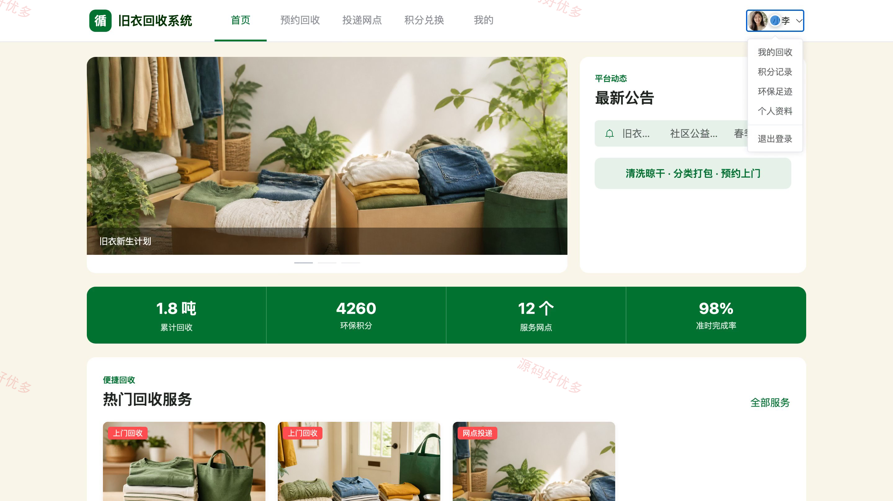
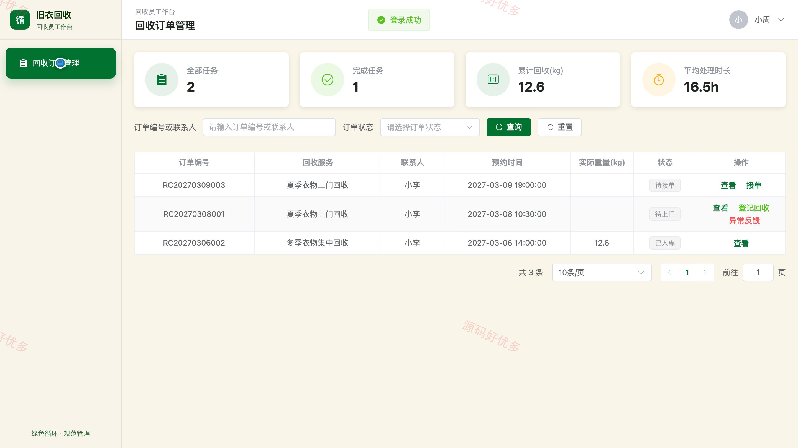
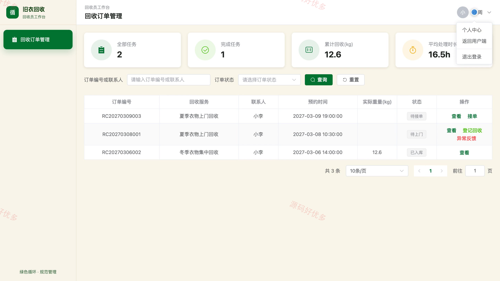
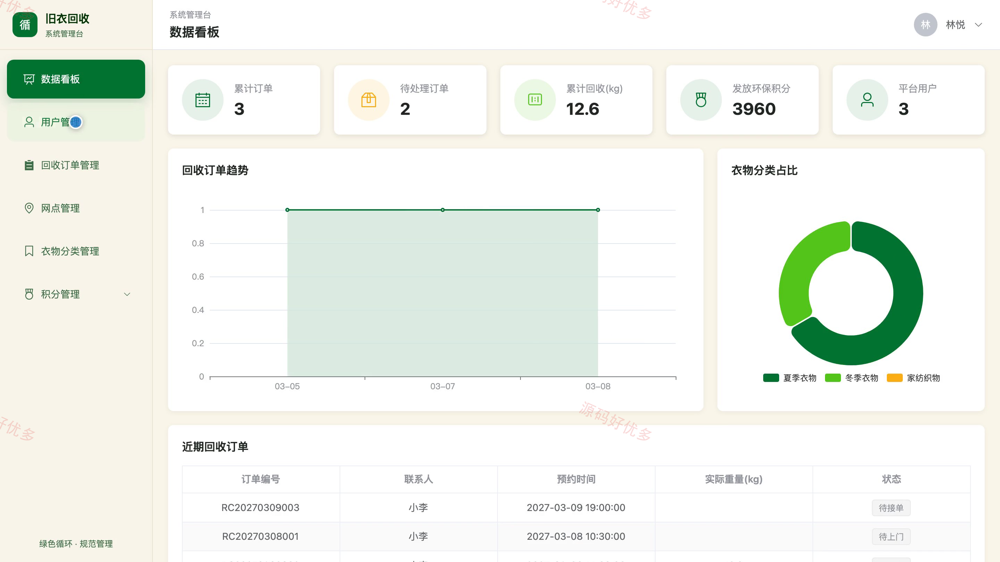
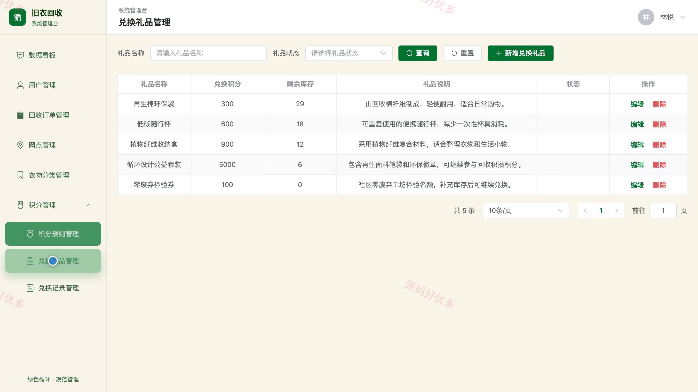

# bs102A
bs102A旧衣回收系统
## 源码问题查看主页咨询

### 一、关键词
旧衣回收、衣物循环利用、上门回收、公益投递、环保积分

### 二、作品包含
源码+数据库+万字设计文档+PPT+全套环境和工具资源+本地部署教程

### 三、项目技术
前端技术： Html、Css、Js、Vue3.4、Element-Plus
后端技术：Java、SpringBoot3.2.0、MyBatis-Plus

### 四、运行环境（以下版本亲测，其他版本兼容性请自行测试）
开发工具：IDEA/eclipse + VSCODE

数据库：MySQL5.7+（共13张表）

数据库管理工具：Navicat10以上版本

环境配置软件： JDK17 + Maven

前端Nodejs：16+

浏览器：谷歌浏览器

### 五、项目介绍
项目编号：bs102A

旧衣回收系统面向居民用户、回收员和系统管理员，居民可预约上门回收或选择附近网点投递旧衣，回收员负责接单、称重并更新订单流转状态；系统依据回收结果发放环保积分，居民可查询积分记录并兑换环保礼品，管理员统一维护回收网点、衣物分类、积分规则和兑换记录。

角色：居民用户、回收员、系统管理员

居民用户功能：居民注册、预约旧衣回收、查询投递网点、跟踪回收订单、查看积分记录、兑换环保礼品、查看环保足迹、维护个人资料。

回收员功能：查看服务区域订单、接收回收订单、登记实际回收重量、更新回收进度、反馈订单异常、查看个人任务统计、查看订单详情、维护个人资料。

系统管理员功能：查看数据看板、管理用户账号、管理回收订单、管理回收网点、管理衣物分类、管理积分规则、管理兑换礼品、处理兑换记录。

### 六、运行截图

